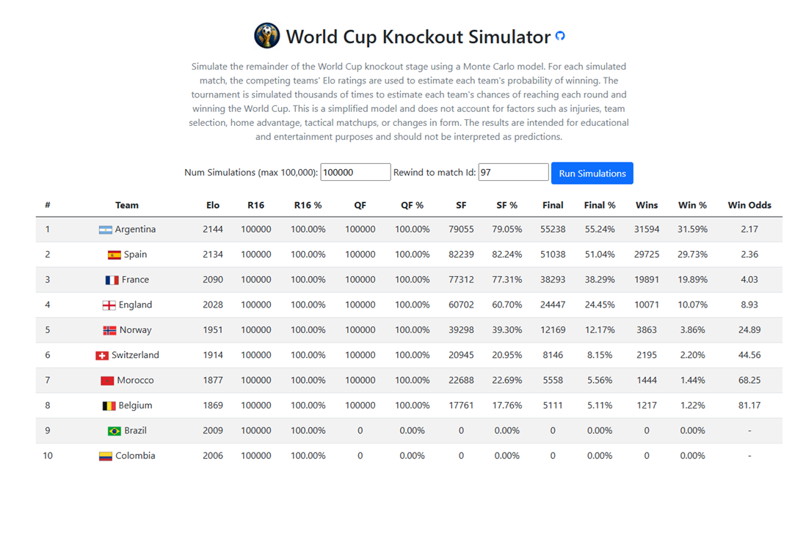

# World Cup Knockout Simulator

A Monte Carlo simulation engine for the FIFA World Cup knockout stage built with **ASP.NET Core**.

🌐 **Try the simulator online:**
**https://worldcupsimulator-gmcdonald-ejagawaya7brgcc5.australiaeast-01.azurewebsites.net/**



The simulator uses the current tournament results together with **Elo ratings** to estimate each team's probability of progressing through the knockout rounds and ultimately winning the World Cup.

## Features

* 🏆 Simulates the entire World Cup knockout tournament
* 🎲 Runs up to one hundred thousand Monte Carlo simulations
* 📊 Calculates the probability of each team reaching:

  * Round of 16
  * Quarter-finals
  * Semi-finals
  * Final
  * Winning the World Cup
* ⚽ Uses Elo ratings to determine match win probabilities
* 🌍 Retrieves the latest fixtures and results from the ESPN World Cup API*
* 🖼️ Displays team names and national flags
* 📈 Shows both raw simulation counts and percentages
* 🚀 Hosted on Microsoft Azure


### Tournament Rewind

The simulator can **rewind the tournament to any point in the knockout stage** by specifying a match ID.

All matches before the selected match remain fixed using their actual results, while the specified match and every subsequent match are simulated. This makes it possible to answer questions such as:

* *What are each team's chances before the quarter-finals begin?*
* *How would the probabilities change before a specific semi-final?*
* *What were the title odds prior to a particular match?*

This feature allows the simulator to recreate the state of the tournament at any stage and generate probabilities based only on the information that was known at that point in time.


## How it Works

1. The application downloads the latest World Cup fixtures and results from ESPN.
2. Completed matches remain fixed using their actual results.
3. Remaining matches are simulated using Elo-based win probabilities.
4. Winners advance through the knockout bracket.
5. The tournament is repeated up to one hundred thousand times.
6. The results are aggregated to estimate each team's chances of advancing and winning the tournament.

## Technology Stack

* ASP.NET Core
* Razor Pages
* C#
* Bootstrap 5
* JavaScript
* ESPN World Cup API
* Azure App Service

## Project Structure

```text
Services/
    EspnWorldCupService      // Downloads and parses ESPN data
    MonteCarloService        // Tournament simulation engine
    TeamInfoService          // Team names, logos and Elo ratings

Models/
    MatchResult
    TeamInfo
    TeamStats
    SimulationStats
    SimulationRequest

Pages/
    Index.cshtml
```

## Simulation Model

Each simulated match:

* Uses Elo ratings for both teams.
* Calculates the probability of each team winning.
* Advances the winner to the next round.
* Updates cumulative statistics for every team.

The simulator keeps track of:

* Round of 16 appearances
* Quarter-final appearances
* Semi-final appearances
* Final appearances
* Tournament wins

## Data Source

The simulator uses match data from ESPN's World Cup scoreboard API.

During the 2026 tournament, live match data was retrieved from the ESPN API. 
Following the conclusion of the tournament, the final match data has been
captured and stored locally with the application.

Using a static snapshot ensures that the simulator remains functional even
if the ESPN API changes or becomes unavailable.


## Running Locally

Clone the repository:

```bash
git clone https://github.com/gmcdonald73/WorldCupSimulator.git
```

Run the application:

```bash
dotnet run
```

or open the solution in Visual Studio and press **F5**.


## Disclaimer

This project is intended for educational and analytical purposes. Simulation results are probabilistic estimates based on Elo ratings and should not be interpreted as predictions of actual tournament outcomes.

## Author

**Graeme McDonald**

Senior .NET Developer with an interest in simulation, quantitative analysis and software engineering.

* GitHub: https://github.com/gmcdonald73
* LinkedIn: https://www.linkedin.com/in/graeme-mcdonald73/

## License

This project is licensed under the MIT License.
